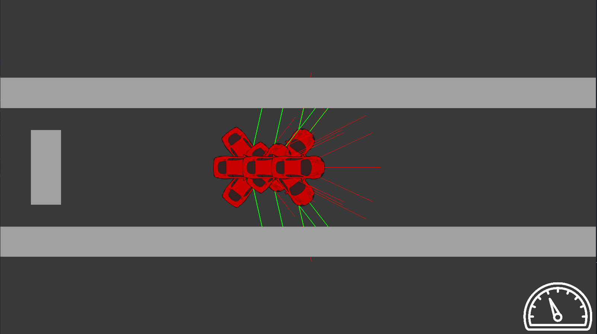
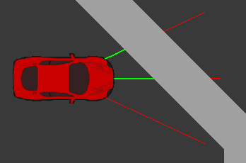

# NEATRacingGame
  
This is an implementation of the NEAT algorithm, which is used to play a racing game.

## NEAT
NEAT, or NeuroEvolution of Augmenting Topologies, is a system which uses Genetic Algorithms to not only evolve the weights of a neural network,
but also its topology (i.e. its structure).
This system was proposed by Kenneth O. Stanley and Riso Miikkulainen in [their 2002 paper](http://nn.cs.utexas.edu/downloads/papers/stanley.ec02.pdf).

## The Game
  
The game is relatively simple: A car needs to be driven around a track, hitting checkpoints along the way. The driver can accelerate, turn to either side, and decelerate.
The only inputs to the neural network are its own normalized speed, and the distance to nearest object along three 'sensor rays'.

## Results
After 128 generations, a neural network is successfuly evolved which is able to drive the entire track while not hitting any obstacles.
